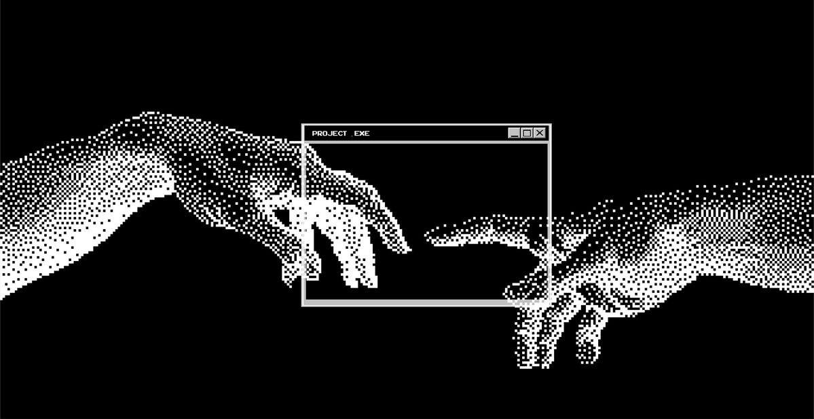

  

<h1 align="center">Hi 👋, Imma JON</h1>

<h3 align="center">🌐 Web Developer</h3>

  

Creating modern, responsive, and interactive web experiences through clean code and thoughtful design.

<h2 align="center">🚀 About Me</h2>

  

**八木ジョナタン**です。

トライデントコンピュータ専門学校のWebデザイン学科でWeb制作を学んでいる学生です。

HTML、CSS、JavaScriptを中心に、Webサイト制作やフロントエンド開発に取り組んでいます。

デザインとプログラミングの両方に興味があり、見た目の美しさだけではなく、ユーザーにとって使いやすく、快適なWebサイトを作ることを大切にしています。

現在は、React.js、Next.js、TypeScript、Three.jsなどの技術を学びながら、インタラクティブなWebサイト制作や、より高度なWeb表現にも挑戦しています。

これまでに、企業やサービスをイメージしたWebサイト制作、WordPressを使用したブログ制作、APIを利用したWebアプリケーション制作など、さまざまな制作経験を積んできました。

分からないことをそのままにせず、自分で調べ、試行錯誤しながら解決することを大切にしています。

新しい技術を学ぶことが好きで、常に成長し続ける姿勢を持って制作に取り組んでいます。

将来は、デザインの知識とプログラミング技術を活かし、ユーザーに良い体験を提供できるWebエンジニアを目指しています。

<h2 align="center">🤝 Connect with Me</h2>

  

  

  

<h2 align="center">💻 Tech Stack</h2>

  

<h2 align="center">📊 GitHub Stats</h2>

<h2 align="center">📈 Activity Graph</h2>

 

### 
<h2 align="center">⌘ Commit Activity</h2>

  

<h2 align="center">⌘ Philosophy</h2>

  

<!-- Proudly created with GPRM ( https://gprm.itsvg.in ) -->
